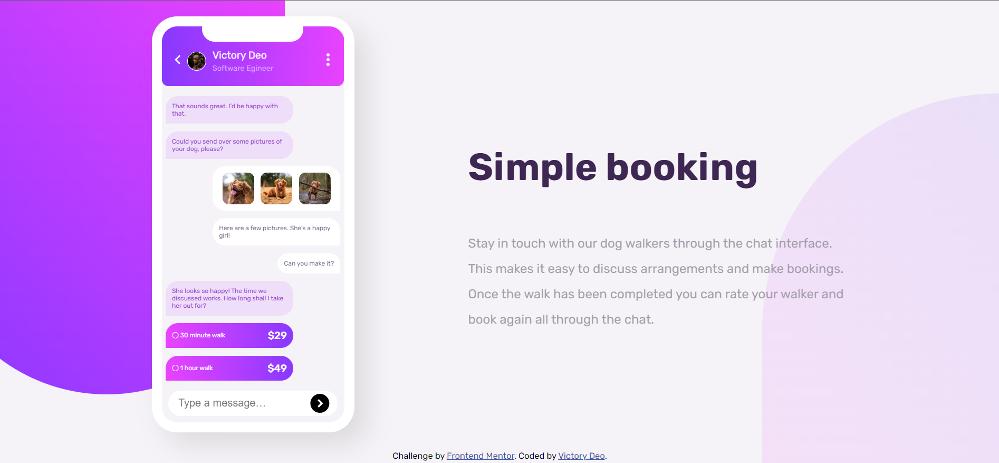
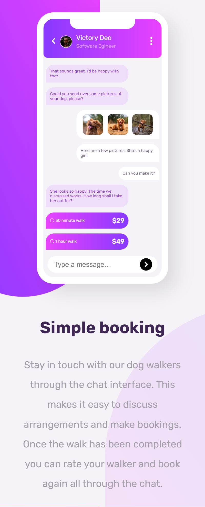

# Frontend Mentor - Chat app CSS illustration solution

This is a solution to the [Chat app CSS illustration challenge on Frontend Mentor](https://www.frontendmentor.io/challenges/chat-app-css-illustration-O5auMkFqY). Frontend Mentor challenges help you improve your coding skills by building realistic projects. 

## Table of contents

- [Overview](#overview)
  - [The challenge](#the-challenge)
  - [Screenshot](#screenshot)
  - [Links](#links)
- [My process](#my-process)
  - [Built with](#built-with)
  - [What I learned](#what-i-learned)
  - [Continued development](#continued-development)
  - [Useful resources](#useful-resources)
- [Author](#author)
- [Acknowledgments](#acknowledgments)

**Note: Delete this note and update the table of contents based on what sections you keep.**

## Overview

### The challenge

Users should be able to:

- View the optimal layout for the component depending on their device's screen size
- See the chat interface animate on the initial load

### Screenshot

### Links
- Live Site URL: [Add live site URL here](https://your-live-site-url.com)

## My process

### Built with

- Semantic HTML5 markup
- CSS custom properties
- Flexbox
- CSS Grid
- Mobile-first workflow

## Author

- Website - [Victory Deo](https://www.victorydeo.wordifysites.com)
- Frontend Mentor - [@Phoenix243](https://www.frontendmentor.io/profile/PhoenixMputu)
- LinkedIn - [Victory Deo Tshimbadi](https://www.linkedin.com/in/victory-deo-tshimbadi-a8a8b920a/)
- Facebook - [Victori Deo Tshimbadi](https://web.facebook.com/profile.php?id=100009472016818)
- Instagram - [@phoenixmputu24](https://www.instagram.com/victory_deo_phoenix/)